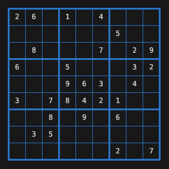

# Go Sudoku 



Just a toy project to scratch the frustrating Sudoku itch ; )

As a software engineer I inherently, and seemingly incorrectly, feel as though I ought to be good at solving Sudoku puzzles.
Whenever frustrated by them I always resort to the sentiment... "_I'll just write a program to solve them all!_".
So, I finally got off my duff and did just that.

This is just a simplistic approach which was created from scratch, without researching optimal solutions as that would
have taken away the fun!  It should solve all deteministic "_expert_" / "_master_" level problems, but is not able to
solve "_extreme_" puzzles which require "_best guess_" style branching.   Maybe in version 2 ; )


## Usage
Simply build and use with any puzzle of your choice
```bash
# Build It
go build sudoku.go

# Solve Sample Puzzles
./sudoku -file=./samples/easy.csv
```

### Flags
The following cmd-line flags can be used to customize the execution...
| Flag | Description |
|------|-------------|
| **-file=./samples/hard.csv** | Path to the Sudoku CSV file (default is '**./sudoku.csv**')|
| **-iter=100** | Maximum number of iterations in which to solve (default is **50**) |
| **-verbose=true** | Whether or not to print all the steps in the solution (default is **false**)|

### CSV File Format
A Sudoku puzzle is expected to be provided as a CSV file similar to those in [samples/](./samples).
A 9x9 comma separated list of the integers **1-9** for known values and "**-**" for unknown values, such as...
```csv
8, -, -, -, -, 6, 1, -, 7
-, -, 5, 2, 1, -, 3, 9, 6
-, 9, -, -, 5, -, 2, -, -
-, 7, -, -, -, 2, 4, -, -
-, 2, 9, 1, -, 5, -, -, 3
5, -, -, -, 7, 4, 9, -, -
9, -, -, 5, 3, -, -, 7, 2
6, 1, -, -, -, -, 5, 4, 9
2, -, -, -, 4, -, -, 3, -
```

## Development
To run the unit tests and view coverage use the following...
```bash
go test -race -coverprofile=coverage.out ./...
go tool cover -func=coverage.out
```

## Future Enhancements
- Optimize portions of the algorithm with parallel routines (hence the mutexes).
- Research optimal solutions and make enhancements.
- Solve "_extreme_" puzzles by making "_best guess_" choices and verify validity.
- Generate new puzzles.
